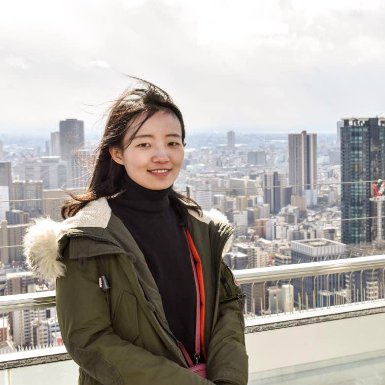

## About Me

Welcome! I am currently a final year Ph.D. student at [Takewaki Lab.](http://takewaki-lab.archi.kyoto-u.ac.jp/takewaki_tsuji_lab/home.php?lang=ENG) in the [Dept. of Architecture and Architectural Engineering](https://www.ar.t.kyoto-u.ac.jp/en), [Kyoto University (KYU)](https://www.kyoto-u.ac.jp/en/), Japan. I have obtained my BS (2009) and MSc (2012) in Civil Engineering, with honors, from the [Dept. of Civil Engineering](http://www.civil.tsinghua.edu.cn/en/ce/index.html) at [Tsinghua University](http://www.tsinghua.edu.cn/publish/thu2018en/index.html) (THU), China.

## Research Interest

My research interests include advanced signal processing and vision-based techniques to structural dynamics, finite element model updating, structural damage identification and their applications, with an emphasis on structural safety against natural and man-made hazards. I also have expertise in Structural Health Monitoring of large-scale bridges.  

## Selected Publications

1. **Guo J**, Wang L, Takewaki I. Frequency response-based damage identification in frames by minimum constitutive relation error and sparse regularization. *Journal of Sound and Vibration*, 443: 270-292, 2019.
[paper](https://www.sciencedirect.com/science/article/pii/S0022460X1830782X)
2. **Guo J**, Wang L, Takewaki I. Modal-based structural damage identification by minimum constitutive relation error and sparse regularization. *Structural Control and Health Monitoring*, 25(12): e2255, 2018.
[paper](https://onlinelibrary.wiley.com/doi/full/10.1002/stc.2255)
3. **Guo J**, Wang L, Takewaki I. Static damage identification in beams by minimum constitutive relation error. *Inverse Problems in Science and Engineering*: 1-25, 2018.
[paper](https://www.tandfonline.com/doi/abs/10.1080/17415977.2018.1553965)
4. **Guo, J.**, Deng, K., He, M., Zhao, C., & Li, W. Experimental study on the construction stages of an RC closure pour in bridge widening. *Journal of Bridge Engineering*, 22(12): 06017007, 2017.
[paper](https://ascelibrary.org/doi/full/10.1061/(ASCE)BE.1943-5592.0001155)

## Awards

Japanese Government Scholarship (University-nominated), Monbukagakusho (MEXT), 2016 – 2019

Tsinghua University Outstanding Master's Thesis (3%), 2012

Best Paper Award, the 20th National Conference on Structural Engineering, Ningbo, China. Nov 2011

Excellent Teaching Assistant in Structural Mechanics I, II, 2011

